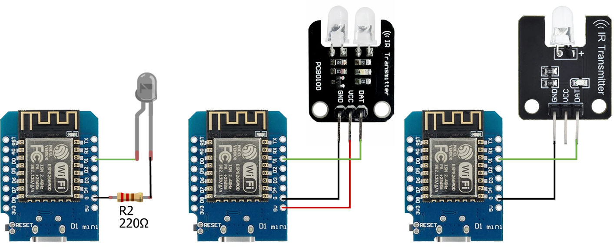
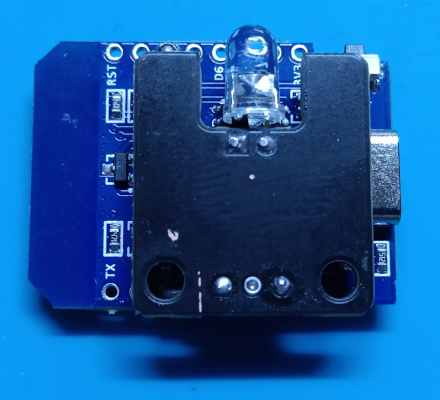
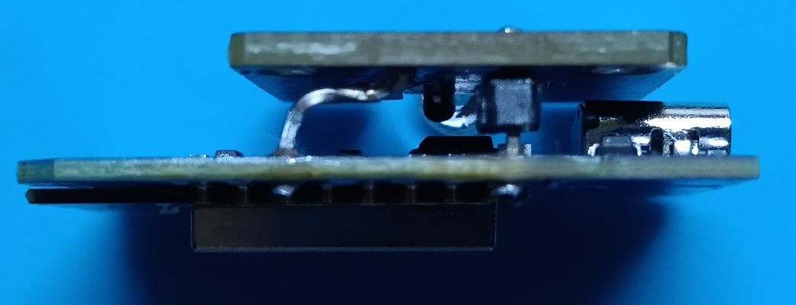
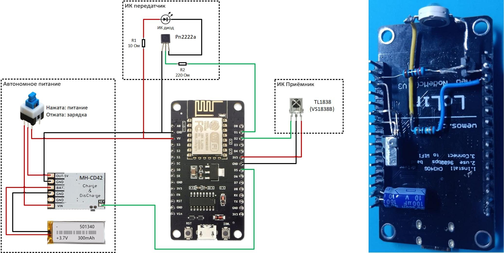
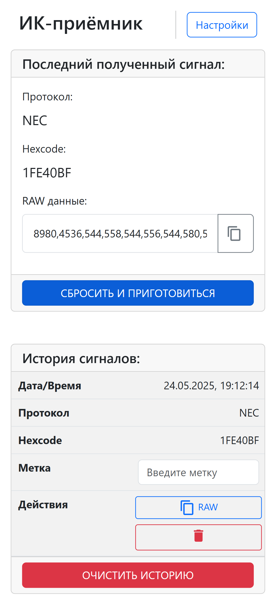
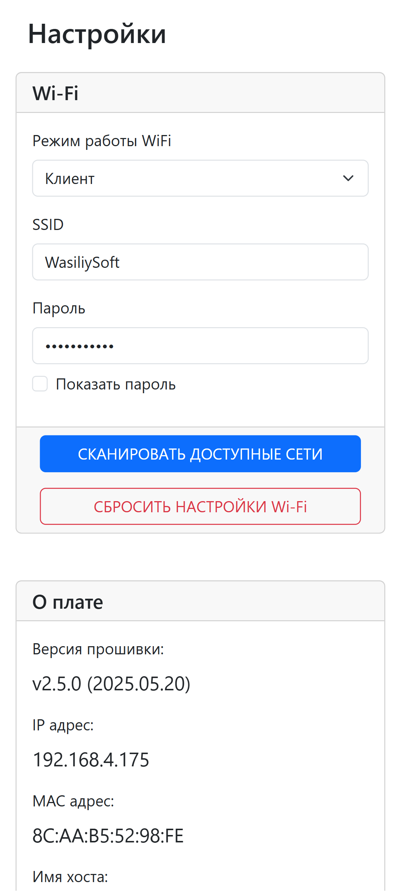

# IrHUB: Внешний ИК-передатчик для работы с приложением IrCode Finder по WiFi

Этот проект представляет собой реализацию внешнего ИК-передатчика на базе платы WEMOS D1 mini, который позволяет управлять устройствами через ИК-сигналы, используя приложение **IrCode Finder**. Проект также включает в себя `ИК-приемник` для захвата и анализа сигналов от пультов дистанционного управления.

## Компоненты

- **WEMOS D1 mini** или **Node MCU v3** — микроконтроллер на базе ESP8266, обеспечивающий подключение к Wi-Fi и управление периферией.
- **ИК-передатчик** — используется для передачи ИК-сигналов.
- **ИК-приемник TL1838 (VS1838B)** — используется для приема ИК-сигналов от пультов дистанционного управления.

### Поисковые запросы для компонентов:
- [Wemos D1 Mini](https://aliexpress.ru/wholesale?SearchText=wemos+d1+mini)
- [ИК-передатчик с 2 диодами `рекомендуется`](https://aliexpress.ru/wholesale?SearchText=2ch+ir+transmitter+module)
- [ИК-передатчик с 1 диодом](https://aliexpress.ru/wholesale?SearchText=ir+transmitter+module)
- [ИК-приемник TL1838 (VS1838B)](https://aliexpress.ru/wholesale?SearchText=TL1838)

## Схема подключения ИК-передатчика
### WeMos D1 Mini
  

### NodeMCU v3 (CH340)
  

## Настройка и запуск

### Загрузка прошивки
1. Скачайте файлы `01_firmware.bin` и `02_filesystem_LittleFS.bin` из раздела [Assets](https://github.com/wasiliysoft/ir_hub/releases/latest)
2. Прошейте файл `01_firmware.bin` через [ESPWebTool](https://esp.huhn.me/). После прошивки плата перезагрузится и создаст точку доступа `AutoConnectAP`, подключитесь к этой точке доступа и перейдите по адресу http://irhub.local/update или http://192.168.4.1/update
4. Прошейте `файловую систему` загрузив файл `02_filesystem_LittleFS.bin`, после перезагрузки снова подключитесь к точке доступа `AutoConnectAP` и завершите настройку через WEB интерфейс.

### Интеграция с приложением **IrCode Finder**
В настройках приложения нужно выбрать тип передатчика `WiFi  (IrHUB)`. Приложение автоматически обнаружит хаб и покажет его IP адрес. Для успешного обнаружения IrHUB и ваше устройство должны быть подключения к одной WiFi сети. 

### Веб-интерфейс для считывания кодов
Перейдите по ссылке [http://irhub.local](http://irhub.local) или по IP-адресу, который будет выведен в `монитор консольного порта`, а так же в виде уведомления если используется приложение `IrCode Finder`.  

На момент публикации прошивки проверена корректность считывания только кодов протокола `NEC`.  

Считанный сигнал нужно дополнить ведущими `0` для получения общей длины кода в `8` символов. По мере тестирования и выпуска обновлений - список протоколов будет дополняться.  

История считанных кодов хранится `локально` на устройстве с которого выполняется подключение к IrHUB.  

  

## Отправка ИК-сигналов без использования приложения:
Выполните POST-запрос на `/sendIr/` с параметрами `freq` (частота в Гц) и `patt` (длительности импульсов, разделенных запятыми).

## Отладка
Для отладки включите флаг `DEBUG` в коде, установив его значение в `1`. Это позволит выводить отладочную информацию в монитор порта.

## Лицензия
Этот проект распространяется под лицензией MIT. Вы можете свободно использовать, модифицировать и распространять код в соответствии с условиями лицензии.

## Автор
Проект разработан WasiliySoft.  
Для связи или вопросов, пожалуйста, посетите [страницу контактов](https://wasiliysoft.ru/contacts/).

## Ссылки
IrCode Finder на [Google Play](https://play.google.com/store/apps/details?id=ru.wasiliysoft.ircodefindernec)  
IrCode Finder на [RuStore](https://www.rustore.ru/catalog/app/ru.wasiliysoft.ircodefindernec)  
Руководство по использованию приложения [на официальном сайте](https://wasiliysoft.ru/ircode-finder-guide/)  
Группа приложения в [Telegram](https://t.me/ircodefinder)
